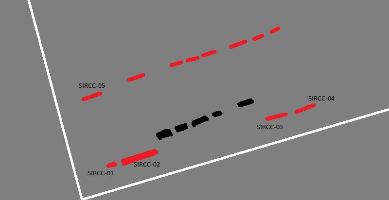
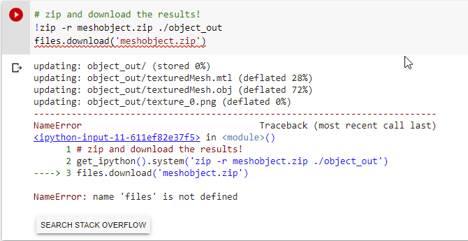
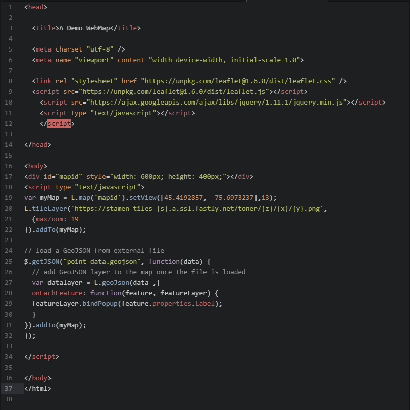
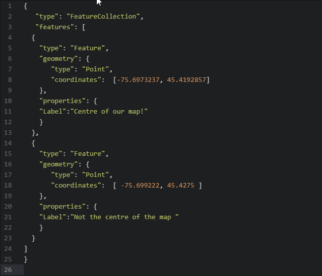
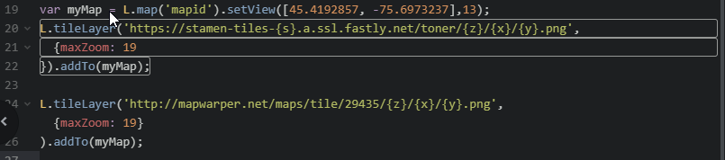
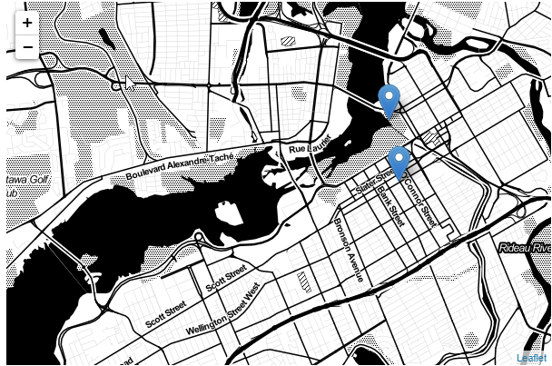
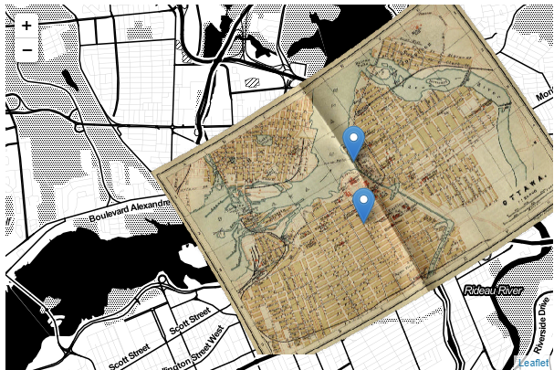
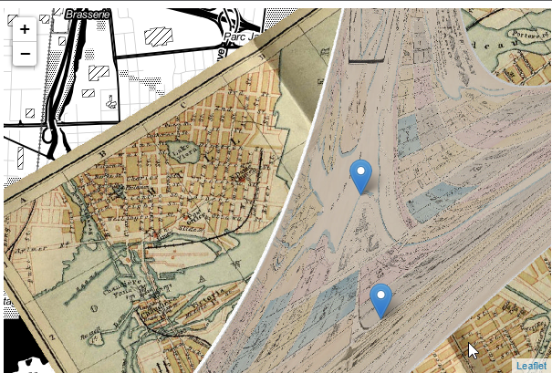
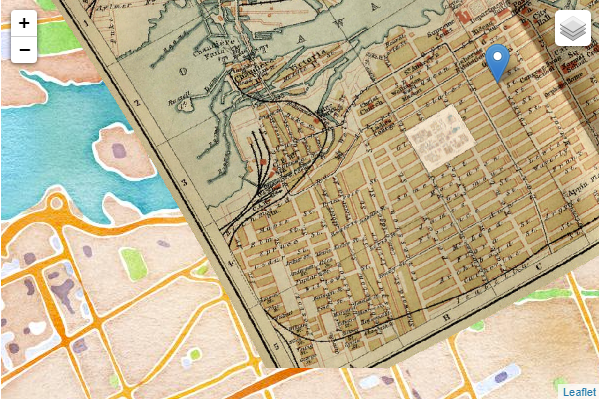
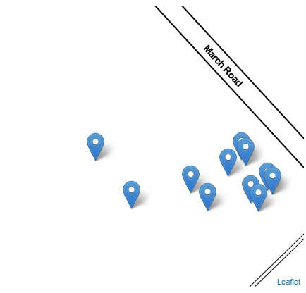

#  Culminative Log: Weeks 1-4
### Daniel Manyoki

##### Graveyard Sketch
1. The initial sketch of the graveyard that I went to illustrates the headstones and memorials in red, while the black is meant to stand in for memorial plaques. The first 5 gravestones I recorded are listed with their memorial number, while the other 5 I recorded were not included in this sketch as they were located 10-15 meters away from the original site in which I recorded.

2. After going and analyzing and recording 5 gravestones in my local cemetery, I returned back home and I uploaded the data into the KoBo Toolbox form. Granted, I did make several mistakes with inputting data. These mistakes included only referring to the memorial number as the number of the grave (so 05, instead of SIRCC-05), as well as forgetting to input data for certain sections such as an inscription for one, the orientation for the first 5 or 6 gravestones I examined, as well as the additional elements and date of monument. In hindsight, this is can translate to significant mistakes when it comes to archaeology, as all of these minor mistakes add up and end up creating a much less complete documentation of a gravestone.

3. Since I was having a tough couple of weeks I went back to the graveyard after a week and decided to record 5 more graves. This time I made sure to record as much data as I could, and fill out the forms as much as I could. I then proceeded to complete the individuals form for the memorials. Only then I realized that many of the graves did not have exact dates sadly, so thereby it was impossible for me to fully fill out those forms, and I just had to be happy potentially only having a death date, and for one there was not even that much.

##### 3D Photogrammetry
1. When using the cellblocks to run the code to stitch a 3D mesh together in the notebook that was linked in the module 1 page related to photogrammetry, I first attempted to complete the process in the most time effective manner. That being, by way of selecting the process of creating the mesh with the images being located in Google Drive. It said the error was due to it being unable to load matches.

2. I ended up ditching this course of action because there were some unforeseen technical troubles in the last cellblock. Identifying "files not defined" as the culprit.

3. So I decided to go back and go down the road of uploading just the images and yet again I encounter an error. This time the error being, seemingly, the exact same issue.

4. So as a result of gloriously failing the first two times, to save myself some unneeded anguish, I decided to do the Buddha statue route, as I believe that the issue must be related to my images as opposed to the code. Yet, for some (pardon my French) fucking reason, the final stage of zipping the mesh decided to also ruin my effort of doing 3D photogrammetry. The pure rage I felt when I saw name error was unbeknownst to man, so I just decided to be done with photogrammetry and move on to Webmaps.

5. This gravestone below was the gravestone I wanted to photogrammify (I don't know if that's a real word, but it is now).

---

##### Webmaps

1. This was probably the most enjoyable part of my week as this portion of my technical experimentation went much better than that of the 3D photogrammetry.

2. Although much of the process was largely copy-paste, I tried my best to actually understand the meanings of the code displayed and recognize what can be fiddled with and what needs to stay relatively static in order for the process to work.

3. When it came to rectifying the image pulled from Library and Archives Canada there was a bit of wonky business when it came to the final product. I believe it potentially came from too few points being selected, although I chose 5 or 6 in the end. It could also depend on the placement of the reference points, whether they were too close to each other or were just completely missplaced.

4. The portion of the lesson I found hardest to understand is the part where variables were introduced. I ended up giving up after a while and just chose to copy-paste the code. I think I understand in relatively simple terms how to replicate what I did, however I will definitely need to revisit this part of the module if I ever come back around to do Webmapping again.

5. After going through the exercise, I went and created a very rough map of the graveyard I have been recording my data at. Upon further review, it would definitely be better if I found a map in which there is satellite imaging so the graveyard and stones are visible. However, this is a future endeavour.

---
